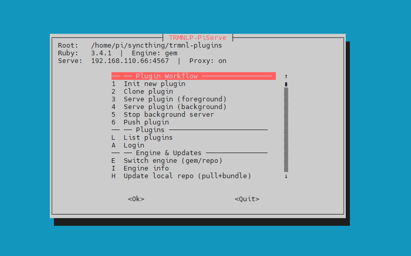

# TRMNLP-PiServe

A shell-based manager for [TRMNL](https://trmnl.com) plugin development on Raspberry Pi. It wraps the `trmnlp` gem (or a local repo checkout) with a TUI menu that handles the full plugin lifecycle: init, clone, serve, push. It also manages Ruby installation, Firefox Nightly for PNG rendering, geckodriver, LAN proxy, and persistent settings.

Built for Raspberry Pi OS Bookworm. Should work on any Debian-based ARM64 or x86_64 system.

This was built for personal use and was completely created using vibe coding, and extensive testing and revisions iterations using ChatGPT and Claude Code (http://claude.com/product/claude-code). 

## What it does

- Interactive TUI menu (whiptail/dialog) with plain-text fallback
- Plugin init, clone, serve (foreground), push
- Two execution engines: installed `trmnlp` gem or local git repo checkout
- Ruby 3.4+ installation via rbenv (if needed)
- Firefox Nightly install (APT with tarball fallback) for headless PNG rendering
- Geckodriver auto-install for selenium-webdriver
- LAN proxy via socat so you can preview from other devices
- Persistent settings and secrets stored in `~/.config/trmnlp-piserve/`
- PRINT_ONLY dry-run mode

## Requirements

- Raspberry Pi OS Bookworm (or Debian-based Linux, ARM64 or x86_64)
- bash 5+
- sudo access (for installing packages)
- Internet connection (for gem/repo install, Firefox Nightly download)

Optional but recommended:

- `whiptail` or `dialog` for the TUI menus (the script offers to install whiptail if missing)
- `socat` for the LAN proxy (auto-installed if enabled)

## Quick start

```bash
git clone https://github.com/Solarmax64/trmnlp-piserve.git
cd trmnlp-piserve
chmod +x trmnlp-piserve.sh
./trmnlp-piserve.sh
```

On first run the script will:

1. Check for Ruby 3.4+ and offer to install it via rbenv if needed
2. Offer to install whiptail for TUI menus
3. Drop you into the main menu

## Development workflow

I develop on Windows and use [Syncthing](https://syncthing.net/) to sync the plugin source to the Pi in real time. When you edit a template on your workstation and save, Syncthing pushes the change to the Pi automatically. If the preview server is running, the served plugin page reflects your edits on the next refresh. No manual file transfers or SSH needed.

## Usage

```
./trmnlp-piserve.sh           # launch the interactive menu
./trmnlp-piserve.sh --help    # print usage summary
./trmnlp-piserve.sh -h        # same as --help
```

## Menu reference

**Plugin Workflow**

| Key | Action |
|-----|--------|
| 1 | Init new plugin |
| 2 | Clone plugin from TRMNL (by plugin_setting_id) |
| 3 | Serve plugin in foreground (Ctrl+C to stop) |
| 4 | Push plugin to TRMNL |

**Plugins**

| Key | Action |
|-----|--------|
| L | List plugins |
| A | Login |

**Engine & Updates**

| Key | Action |
|-----|--------|
| E | Switch engine (gem or repo) |
| I | Engine info |
| H | Update local repo (git pull + bundle install) |
| U | Rebuild gem from local repo and install |

**PNG Rendering**

| Key | Action |
|-----|--------|
| N | Install or update Firefox Nightly + geckodriver |
| T | Test headless PNG renderer |

**System**

| Key | Action |
|-----|--------|
| S | Settings |
| 0 | Exit |

This tool manages the plugin lifecycle (init, clone, serve, push) but is not a code editor. To view or edit plugin source files, use your preferred editor or IDE directly on the plugin directory under your plugins root.

## Screenshots



## Configuration

### Environment variables

These can be set before launching the script to override defaults:

| Variable | Default | Description |
|----------|---------|-------------|
| `ENGINE` | `gem` | Execution engine: `gem` or `repo` |
| `REPO_DIR` | `$HOME/trmnlp` | Path to local trmnlp repo checkout |
| `BIND_PORT` | `4567` | Port for the preview server |
| `ENABLE_PROXY` | `1` | Enable LAN proxy via socat (1 = on, 0 = off) |
| `SHOW_BACKUPS` | `0` | Show `*.bak-*` directories in plugin list |
| `PRINT_ONLY` | `0` | Dry-run mode: print commands instead of executing |
| `TRMNLP_TUI` | `1` | Use whiptail/dialog TUI (0 = force plain text menus) |
| `FFN_LANG` | `en-US` | Firefox Nightly locale |
| `FFN_URL` | (empty) | Custom Firefox Nightly download URL |

### Settings file

Settings are persisted to `~/.config/trmnlp-piserve/settings.env`. You can edit this file directly or use the settings menu (S). Changes made through the menu are saved automatically.

### Secrets

API keys are stored in `~/.config/trmnlp-piserve/secrets.env` with mode 600. The script sources this file when needed for clone and push operations.

## Engine modes

### Gem mode (default)

Uses the installed `trmnl_preview` gem. Install or update it with menu option U (builds from the local repo checkout and installs the gem).

### Repo mode

Runs trmnlp directly from a local git checkout using Bundler. Useful for development or testing unreleased changes. Update with menu option H (git pull + bundle install).

Switch between engines with menu option E or by setting `ENGINE=repo` before launching.

## PNG rendering

To render plugin previews as PNG images (instead of just HTML), you need:

1. **Firefox Nightly** - for headless screenshot rendering
2. **geckodriver** - for selenium-webdriver to control Firefox
3. **xvfb** - if running without a display (headless Pi)

Menu option N handles all of this. It will:

- Add the Mozilla APT repo and install `firefox-nightly` (falls back to tarball on ARM if APT fails)
- Install geckodriver from GitHub releases
- Install xvfb and rendering dependencies
- Run a test screenshot to verify everything works

You can test the renderer any time with menu option T.

If Firefox Nightly is not installed, the script will warn you but still let you serve plugins. HTML preview works without it; only PNG export requires it.

## LAN proxy

When `ENABLE_PROXY=1` (the default), the script starts a socat proxy that binds to your Pi's LAN IP on the configured port. This lets you open the preview from any device on your network.

The proxy automatically cleans up stale socat processes on the same port before starting a new one.

Disable it with `ENABLE_PROXY=0` or through the settings menu.

## File locations

| Path | Purpose |
|------|---------|
| `~/.config/trmnlp-piserve/settings.env` | Persisted settings |
| `~/.config/trmnlp-piserve/secrets.env` | API keys (mode 600) |
| `~/.config/trmnlp-piserve/ff-profile/` | Firefox profile for headless rendering |

## Troubleshooting

**Ruby version too old / not found**
The script checks for Ruby 3.4+ on startup. If it is not found, it offers to install via rbenv. If you already have rbenv, make sure it is initialized in your shell (`eval "$(rbenv init - bash)"`).

**PNG rendering fails**
Run menu option T to test the renderer. Common issues:
- Firefox Nightly not installed (run N)
- geckodriver not installed (run N, it installs both)
- Missing libraries: run `ldd $(which firefox-nightly) | grep 'not found'`
- Another Firefox instance locking the profile
- No display and xvfb not installed: `sudo apt install xvfb`

**"trmnlp command not found"**
Either install the gem (menu option U) or switch to repo engine (menu option E).

**socat "address already in use"**
The script kills stale socat processes on the bind port automatically. If it persists, check for other services on the port: `ss -tlnp | grep 4567`.

**whiptail/dialog not available**
The script falls back to plain text menus. Install whiptail with `sudo apt install whiptail` or let the script offer to install it on first run.

## License

[MIT](LICENSE)
